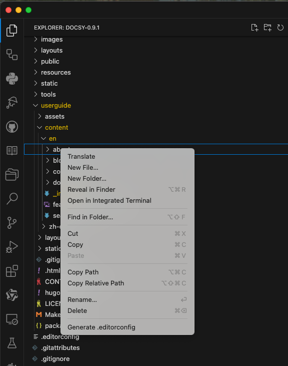

# Introduction

**Documment Translator** aims to easier the effort to translate Hugo documentation using VS Code.

## Features

* Translate [Hugo](https://gohugo.io) documentation using Google Translate.

    Open **Explorer** and navitage into the folder or file you want to translate, then right click to open the context menu and select **Translate**. As shown in the following image, the selected file / files in the folder will be translated and the result will be saved in the folder according to the Hugo configration.

    

## Extension Settings

This extension contributes the following settings:

* `documentTranslator.setting.sourceLanguage`: Specify the source language of these documents..
* `documentTranslator.setting.tokenPath`: Path to the translator token file.
* `documentTranslator.setting.translatorDownloadURL`: Specify the URL for downloading the translator.

## ## Known Issues and Troubleshooting

### Installation Issues

1. **Empty Translator Download**: If the translator binary downloads as an empty file, try:
   * Checking your internet connection
   * Verifying the download URL in settings
   * If the issue persists, manually download from the release page

2. **Permission Issues**: On Unix-like systems (macOS, Linux), if you get permission errors:
   * The extension will automatically try to make the translator executable
   * If that fails, manually run: `chmod +x path/to/translator`

3. **Binary Location**: The translator binary should be in the following location:
   * Windows: `<extension-path>/bin/translator.exe`
   * macOS/Linux: `<extension-path>/bin/translator`

### Usage Issues

1. **Configuration**: Make sure you have set up:
   * Hugo configuration file (`hugo.toml`) in your workspace

2. **File Access**: Ensure the extension has access to:
   * The source files you want to translate
   * The token file specified in settings
   * The workspace directory

### Reporting New Issues

If you encounter any issues not listed here, please report them on our [GitHub issues page](https://github.com/wiseinf/translator/issues) with:

* A description of the problem
* Steps to reproduce (please include the file you are trying to translate)
* Your system information (OS, VS Code version)
* Relevant error messages from the Output panel (output from the **Output** view, select the **Document Translator** from the dropdown menu on the right)

## Release Notes

### v0.0.1

Initial release of Document Translator.

**Enjoy!**
